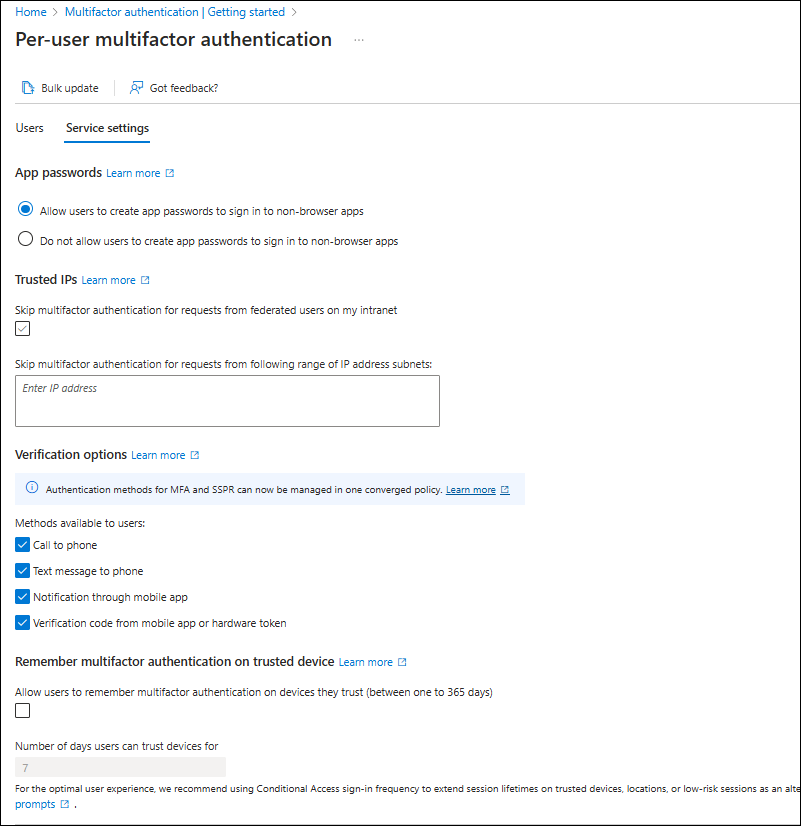
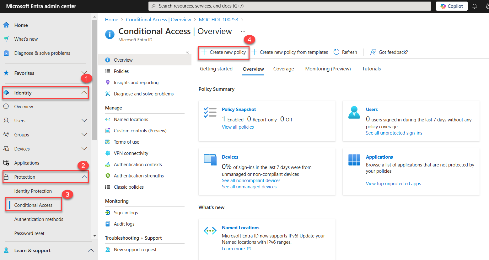
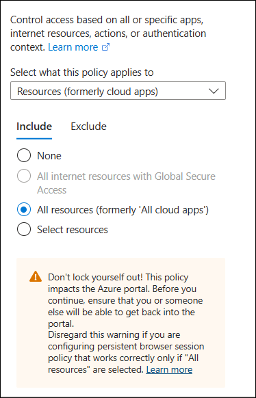
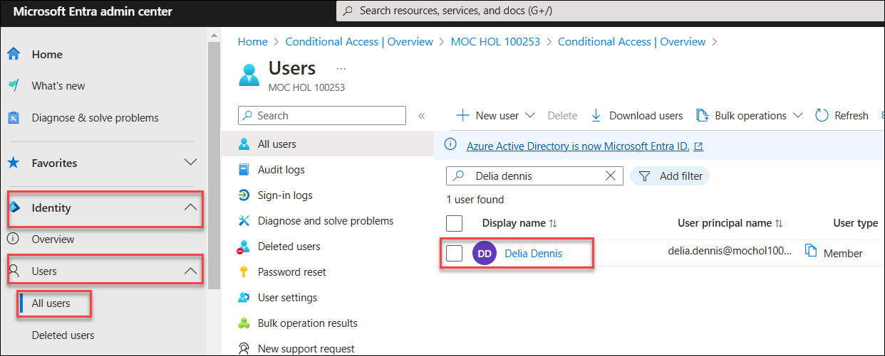
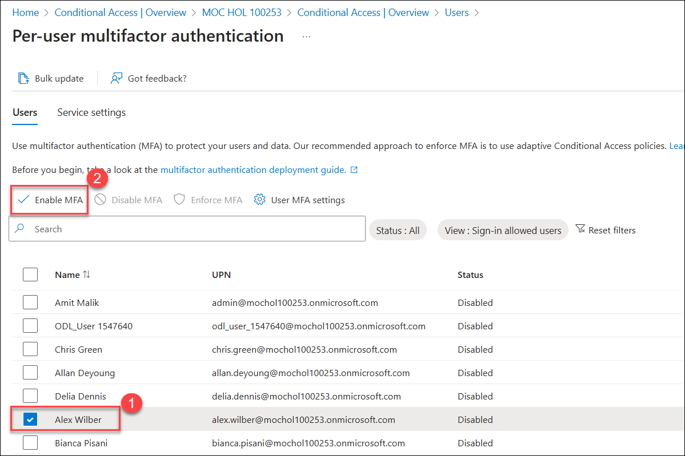
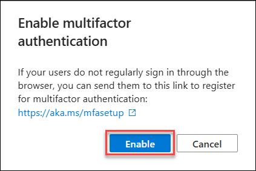
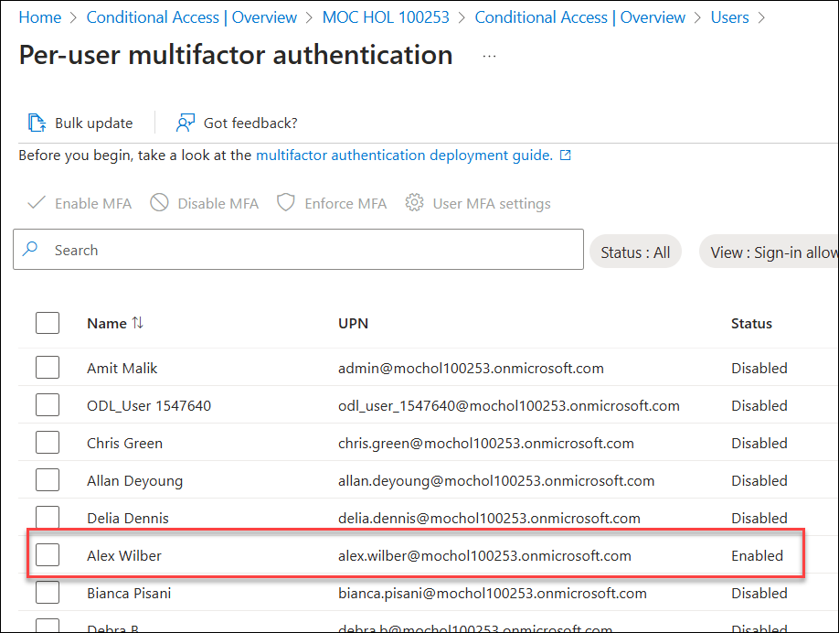

# Lab 08 - Enable Microsoft Entra ID  multi-factor authentication

## Lab scenario

To improve security in your organization, you've been directed to enable multi-factor authentication for Microsoft Entra ID.

## Lab Objectives

After completing this lab, you will be able to complete the following exercises:

- Exercise 1 - Review and enable Multi-factor Authentication in Azure
- Exercise 2 - Configure MFA to be required for login

## Architecture Diagram

### Estimated time: 30 minutes

>**IMPORTANT** - A Microsoft Entra ID Premium license is required for this exercise.

## Exercise 1 - Review and enable Multi-factor Authentication in Azure

  In this exercise, you will learn how to  enhance security, and ensure Multi-factor Authentication (MFA) is configured and enabled in your Azure environment, adding an extra layer of protection for your accounts and data.

### Task 1 - Review Azure Multi-Factor Authentication options

1. Browse to the [https://entra.microsoft.com](https://entra.microsoft.com) and sign in using the credentials provided in the environment. (Global administrator privilages are provided for this account)

   - **Email/Username:** <inject key="AzureAdUserEmail"></inject>
   - **Password:** <inject key="AzureAdUserPassword"></inject>

    

1. On the search feature type **multifactor**, and in the search results select **Multifactor authentication**.
Alternatively, you can open **Identity**, then select **Protection**, and select **Multifactor authentication**.

1. On the **Multi-Factor Authentication | Getting started** page, under **Configure**, select **Additional cloud-based MFA settings**.

    

1. In the new browser page, you can see the MFA options for Azure users and service settings.

    

1. This is where you would select the supported authentication methods, in the screen above, all of them are selected.

1. You can also enable or disable app passwords here, which allow users to create unique account passwords for apps that don't support multi-factor authentication. This feature lets the user authenticate with their Microsoft Entra ID identity using a different password specific to that app.

### Task 2 - Setup conditional access rules for MFA for Delia Dennis

Next, let's examine how to set up Conditional Access policy rules that would enforce MFA for guest users accessing specific apps on your network.

1. Switch back to the Microsoft Entra admin center and select **Identity (1)**, then **Protection (2)**, and then **Conditional access (3)**. Click on **+ Create new policy (4)**.

    

1. If you encounter following error, click on **Disable security policy**, on **Security default** specify the following:

    - Security defaults **Disabled(1)** 

    - Reason for disabling Select **My organization is planning to use Conditional Access (2)**.

    - Click on **Save (3)**

    

    

1. On **Disable security policy** pop up, click on Disable.
   
    

1. Again navigate to **Conditional access** blade, from the menu, click on **+ Create new policy**.
   
    
   
1. Name your policy, for example **MFA_for_Delia**

1. Under Assignments:

    - Select **0 users and groups selected**  
    - On the right side screen, select **Select users and groups** check box to configure.
    - Check **Users and groups** (available users will be populated to the right)
    - Choose **Delia Dennis** from the list of users then choose **Select** button.

1. Under **Target Resources** click on **No target resources selected**

   - In the dropdown, make sure **Resources (formerly cloud apps)** is selected.
   - Under Include, mark **All resources (formerly All cloud apps)** and note the warning the pops up about possibly locking yourself out.

      

   - Now under Include, change your choice to **Select resources** item and then under Select click on **None**.
   - In the newly opened dialog, choose **Office 365**.
   - Choose **Select**.

1. Review the Conditions section.

   - Under **Conditions** click on **0 conditions selected** then under **Locations** click on **Not Configured** and then under  **Configure** toggle  it to **Yes (1)**  and ensure that under **Include** ,**Any network or location (2)** is selected.

      

1. Under **Access Controls**, find the **Grant** section and click on **0 controls selected** and verify **Grant access** is selected.

1. Select the **Require multi-factor authentication** check box to enforce MFA.

1. Ensure that **Require all the selected controls** is selected.

1. Select **Select**.

1. Set **Enable policy** to **On (1)**. Hit **Create (2)** to create the policy.

    

1. MFA is now enabled for your selected user and application(s). The next time a guest tries to sign into that app they will be prompted to register for MFA.

     > **Congratulations** on completing the task! Now, it's time to validate it. Here are the steps:
     > - Hit the Validate button for the corresponding task. If you receive a success message, you can proceed to the next task. 
     > - If not, carefully read the error message and retry the step, following the instructions in the lab guide.
     > - If you need any assistance, please contact us at labs-support@spektrasystems.com. We are available 24/7 to help

     <validation step="7a3d51d2-0661-4532-8946-cc1d0e7f846c" />

### Task 3 - Test Delia's login

1. Open a new **InPrivate** browsing window.
1. Connect to https://www.office.com.
1. Select the sign-in option.
1. Enter Delia Dennis's username and password.

    - To get the username for **Delia** follow the below steps:
  
    - In **Microsoft Entra admin center** and from left navigation pane under go to **Identity**, and click on **All users** under **Users** then choose **Delia Dennis**.

      

    - On the **Delia Dennis** user blade, copy the **User principal name** record in notepad.

      
    
    - To find the password, from the top navigation pane  click on **Reset Password** and copy the temporary password record in notepad.

       

1. Navigate back to https://www.office.com in **InPrivate** browsing window then click on **Sign in**.

    

1. Sign in **Delia Dennis** Username and temporary password which you recorded in notepad.
   
 
   >**Note:** There is a chance that you might get a login failure message with several options on how to proceed.  Select the **Try Again** option in this case.

1. Click on **Next** on **More information required** pop up.

    

1. You can see that because of the Conditional Access rule we created for Delia, MFA is required to launch Office 365 home page.

   

## Exercise 2 - Configure MFA to be required for login

  By enforcing MFA, you significantly reduce the risk of unauthorized access and data breaches, enhancing the overall security of your Azure environment.

### Task 1 - Configure Microsoft Entra ID Per-User MFA

Finally, let's look at how to configure MFA for user accounts. This is another way to get to the multi-factor auth settings.

1. Switch back to the Microsoft Entra admin center and find the Indentity left-hand navigation menu.

1. Select **Users**, then select **All users**.

1. At the top of the Users pane, select **Per-user MFA**.

    >**NOTE:** you may have to use the elipsis (...) to get to the Per-user MFA menu item.

   

1. Select **Alex Wilber (1)** with a check-mark. Select the **Enable (2)** option under quick steps.

   
   
1. Read the **Enable multifactor authentication** notification popup, then select **Enable** button.
    
    

1. Select **Close**.

1. Notice that Alex now has **Enabled** as her MFA status.

   

1. Close the MFA setting tab.

## Review

In this lab you have completed the following tasks:
- Reviewed and enabled Multi-factor Authentication in Azure
- Configured MFA to be required for login

## You have successfully completed the lab

